## COM1025: Web and Database Systems

## LAB 1

In this first Lab you will start by becoming familiar with the software that we will be using for the database and web development as well as the entity-relationship (data) modelling. You will be using the software installed for you in Azure Labs via the terminals in the IFH Lab. You can access Azure from a browser on your own computer as well. If you prefer, you can also install the software on your own laptops to use for the lab sessions and for independent learning.

The software we will be using is:

- [Laragon](https://laragon.org/). An open-source (free) web
  development tool that packages the MySQL Server, Apache Server and Node in one environment.
  Laragon is similar to Xampp (Linux) and Mamp (Macs).

- [Diagram.net](https://app.diagrams.net/). For the Data Modelling we will be using diagrams.net, a free web-based software that does not need login credentials and is easy to use

You will first check that the software is configured and working properly and then you will run some code from a student’s project in a previous year to get an idea of the end goal of the module. You should be aware that, last year, we are using PHP and this year we are using NODE. As such, we've recreated a this particular student's project in NODE.

## Laragon Software Set-Up Azure Labs

1. Log on to your terminal in the Lab with the university username and password.
2. Open your university outlook email account – you will find an email from IT Services with a
   link to register with Azure Labs. That link will require you to sign in using your university
   account and then you will see a page with the following ‘virtual machine’:
   COM1025: Web and Database Systems.

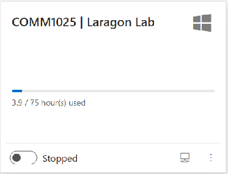

To sign on to the virtual desktop that is running Laragon, you will need different credentials to your university login details. Click on the three dots and then the option ‘Reset password’.

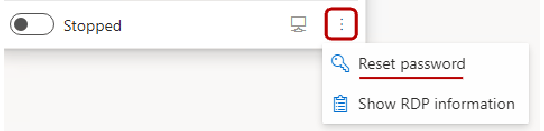

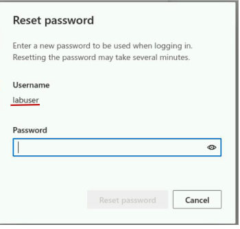

Type in a password you want in the pop-up window and then click on the button ‘Reset
password’. This might take some time. Note that the username has already been set to
‘labuser’ – this cannot be changed.

3. Once the password has been set, toggle the virtual machine from ‘Stopped’ to ‘Running’. This may also take a few moments the first time. When it has changed the status to ‘Running’, then elect the small monitor icon at the bottom which will download a connection file with a .rdp extension.

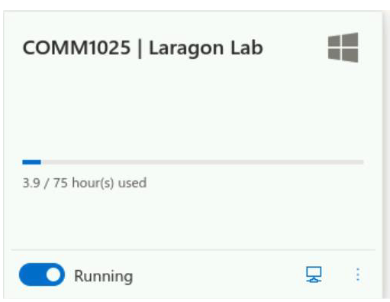

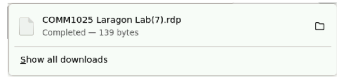

1. Next click on the .rdp file, which will run the file. If you see the following pop-up window just click cancel on this message. You should see a window as shown below where you will be asked to enter a password. The username has been set to labuser by default – you need to remove the ~\. Add the new password you created previously.

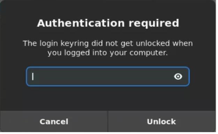

5. You should see a window as shown below where you will be asked to enter a password. The
   username has been set to labuser by default – **you need to remove the ~\.** Add the new
   password you created previously.

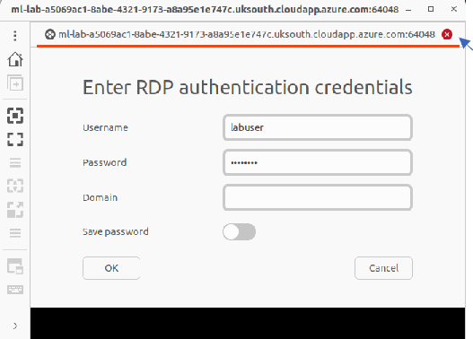

6. Press OK to continue. The virtual desktop will display as below. If the desktop does not fit the screen you will need to click on the button highlighted in red to scale the desktop correctly. If you are prompted to sync your OneDrive then you can do so by entering your university username and password. Do NOT click on the cro``ss in the red circle

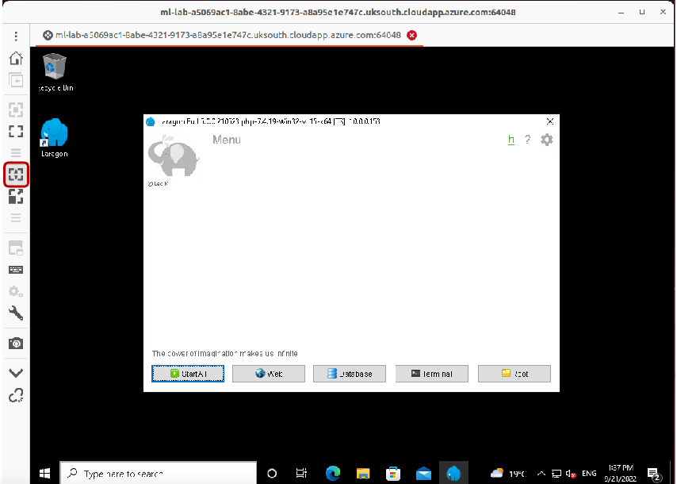

7. You should, now, be able to open Laragon by clicking the desktop icon. To start MySQL press the "Start ALL" button. You should see the Apache daemon and the MySQL server being started. The 80 and the 3306 are their port numbers, respectively.

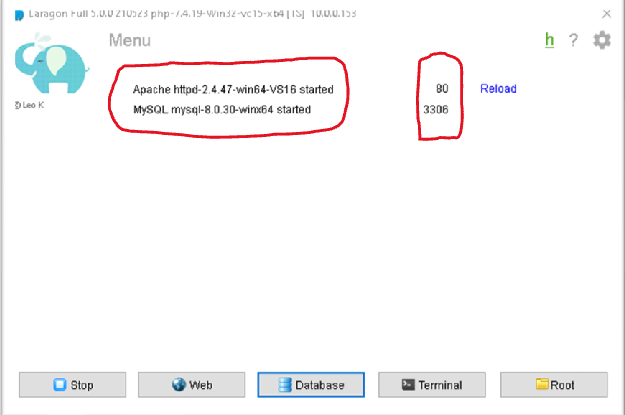

### Using MySQL

1. Now let us try out the MySQL Server. On the main menu of Laragon click on the button that
   says Terminal. A command line terminal window will pop up. The prompt will be showing
   `C:\laragon\www`. We need to navigate to the folder from where we can start MySQL.

2. Type in `cd ..` after the prompt and press ENTER (this will take you one level up to the Laragon directory) TIP: You can use the command `ls`` to list the folders and files in a directory.

3. Then type in or copy-paste the path to the MySQL bin directory from where we can
   run the server: `cd bin\mysql\mysql-8.0.30-winx64\bin`

4. Now type in the command to get MySQL started: `mysql -u root -p` and press ENTER. It will prompt you for a password. Just press ENTER again because a password has not been specified. The username is root. You should get a welcome message from the MySQL monitor. Type in the following command at the mysql> prompt: `SHOW databases;` (don’t forget the semi-colon) and you will get a table with all the current databases listed as shown in the screenshot below.

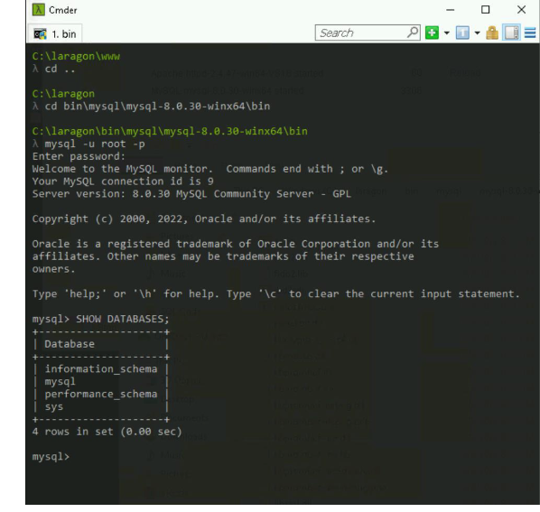

> > This shows that your software is working fine. If you want to close the Terminal then
> > type in exit to shut down the MySQL monitor first. You will be using it again later so
> > better to keep it open.

**IMPORTANT – Click on the Stop button on the Laragon menu if you want to close it. This will
shut down the servers properly and prevent you having any problems with them.**

### Running the Code of a Library System (student project)

In this part you are going to run the code from a student’s sample project from a previous year. Recall from earlier, this project has been migrated from PHP to Node. This will give you an idea of what you will be expected to produce at the end of the semester. You are not expected to understand the code yet, just to make the code work and get an idea of what the code is doing. In this section you will also get experience with using the GUI that comes with Laragon called HeidiSQL.

Firstly, we need to get hold of a copy of the project; to do this, we will use Git. [Git](https://git-scm.com/) is a free and open-source distributed version control system widely used in the programming industry. For this module, you'll see it popup every now and then; however, we won't use it extensively.

Let's get going:

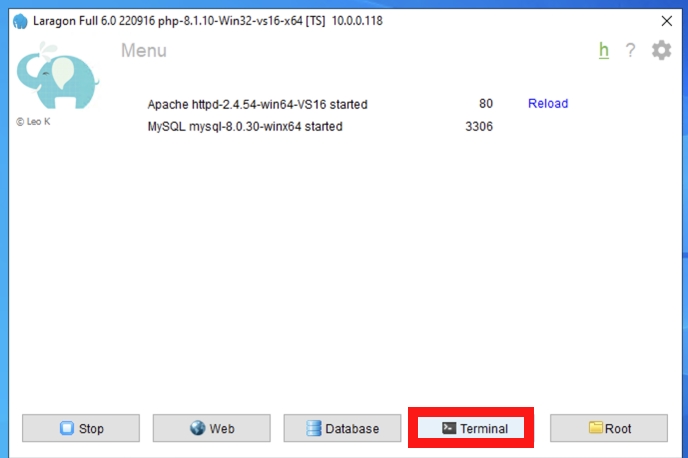

1.Let's dive back into the command line: open the Laragon terminal.

- We want our code to be in a dedicated directory. Type into the terminal `mkdir C:\code` and press enter to create a "code" directory in the root of your C drive. **Moving forward, I'll refer to entering a command and pressing enter and running. For instance, run the command `mkdir C:\code`**.
- Next, navigate to the code directory. Run the command `cd C:\code` and press enter. You should now be in your code directory.

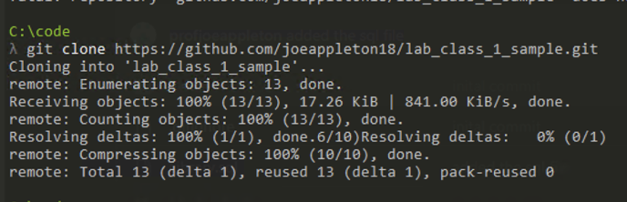

- You can now get a copy of the library project by running the command `git clone https://github.com/joeappleton18/lab_class_1_sample.git`. This should have downloaded a copy of the library project into the folder ` lab_class_1_sample``. You can check this by running the  `ls` command to list the contents of your code directory.

- Navigate into the lab_class_1_sample directory by running the command `cd lab_class_1_sample`.

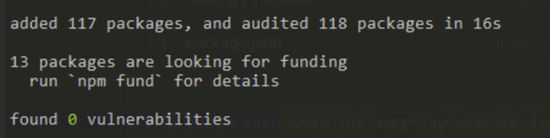

- This project has a few dependencies. Dependencies, in this context, are third-party Node packages that we can use to make our programming lives easier. We need to install them, so our library program can run. To do this, run `npm install`.

**Before we can run our application we need to create the library database**

- Click on the button called Database on the Laragon main menu and you will get a
  window as below. This is a free software called HeidiSQL that acts as an administration tool
  for MySQL and other DBMSs. Make sure you have selected the same settings as above. Select the libmysql.dll Library (circled in red above) from the drop-down list. Then click on Open and the HeidiSQL GUI hould be launched.

**Make sure you have selected the same settings as above**. Select the libmysql.dll Library
(circled in red above) from the drop-down list. Then click on Open and the HeidiSQL GUI
should be launched.

- Now you want to load the library.sql file. Click on file at the top left corner and then select Load SQL file. A file explorer should be displayed,navigate to `C:\code\lab_class_1_sample` and select `library.sql`.

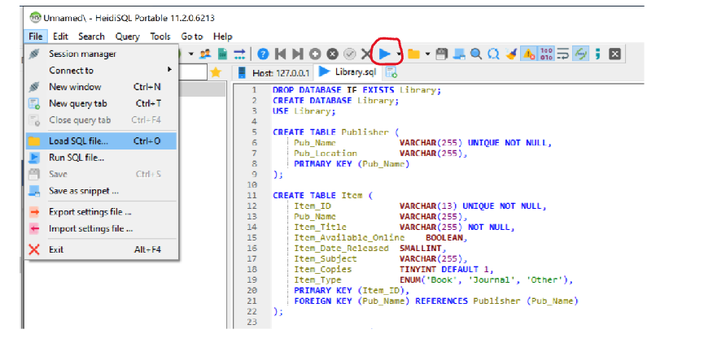

- Now click on the blue triangle that will execute all the queries in the file which will create a database called library and create tables in the database and load the tables with data. Right-click on the session (Unamed) and select refresh. You will then see library listed amongst the databases in the left pane.

**we are now ready to run our program**

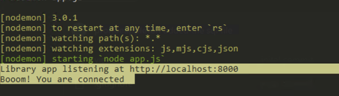

- Open the Laragon terminal and ensure you are in your project directory by running `cd C:\code\lab_class_1_sample`. Finally, to run your program, run the command, `npm run start`. If all has gone well, you should see the following output in the terminal: "Booom! You are connected".

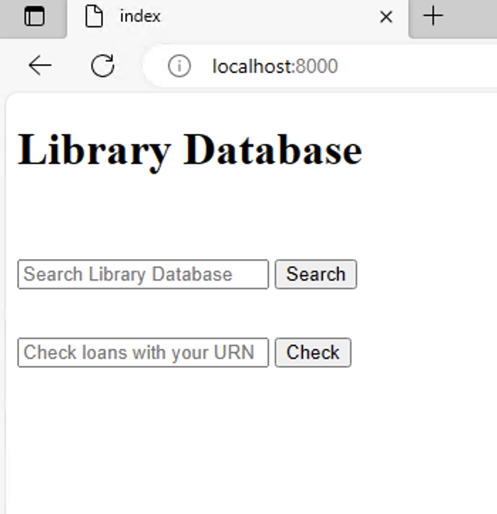

- You can now visit your web application by navigating, in a web browser, to "localhost:8000".

**Paying around with the sample program**

1. Type in web in the text box where it says Search Library Database and click on Search. You will see a list of two books and a journal. Select one of these items. On the page that shows put down 6663211 as the URN. A message should show that the book has been added to your account. Select Back to Home. Now type in php and repeat the steps with the same URN. Finally put the URN in the textbox that says Check Loans with your URN and click on the Check button. You should see the two loans made by that student. Have a look at the url string.

2. Finally, stop you node application from running, by opening the terminal and pressing `ctrl C`. Change directory to your MySQL bin directory by running `cd bin\mysql\mysql-8.0.30-winx64\bin`. Next open the MySQL terminal tool, type in the command `mysql -u root -p ` . Run the following statements and observe the outputs and see if you can figure out what these commands do:

- `SHOW databases;`
- `SHOW tables;`
- `USE library;`
- `SHOW tables;`
- `SELECT * from author;`
- `SELECT * FROM author WHERE Auth_Title = "Prof";`
- `SELECT Auth_LName FROM author WHERE Auth_Title = "Prof";`
- `SELECT Item_Title FROM Item WHERE Item_ID IN (SELECT Item_ID FROM Loan WHERE
URN=6543210);`

NOTE you are using the same database from the Terminal and the GUI. I wanted you to get the experience of both. I would recommend getting familiar with the Terminal, but you won’t be able to save any queries. However, you can copy paste them into notepad++ and save that file. From HeidiSQL under File you have the option of saving any queries you write as a .sql file.

In the future you can connect to the virtual machine via the following URL:
https://labs.azure.com/virtualmachines

## Using diagrams.net for Entity-Relationship Modelling

diagrams.net. is a freely available online drawing tool that can be found at: http:\\www.diagrams.net

- Click on the button that says start
- Click on Create New Diagram
- Select Blank Diagram and then click on the button that says Create. The file-explorer will open for you to specify a name for the file. You can call it – library and then click on save (it would be a good idea to create a folder called Data Modelling or ER Diagrams where you can save all your diagrams). The blank diagram gives you the option to use whatever notation you want.
- On the Left panel you will see the option for Entity Relation. Select that and you will see several different shapes and notations for ERDs available to you.
- Draw a simple entity with a few attributes (Chen’s notation) as shown in the diagram below. You will be using this early on in your modelling to understand the different types of attributes better.

- Finally try out the crows-foot notation that we will be using later for ER Modelling and you will use for your coursework. The ER diagram below is a sample from the same project that you tried out the code for. You just need to try out a couple of entities and the different
  relationship types (one-to-many, many-to-many, etc).

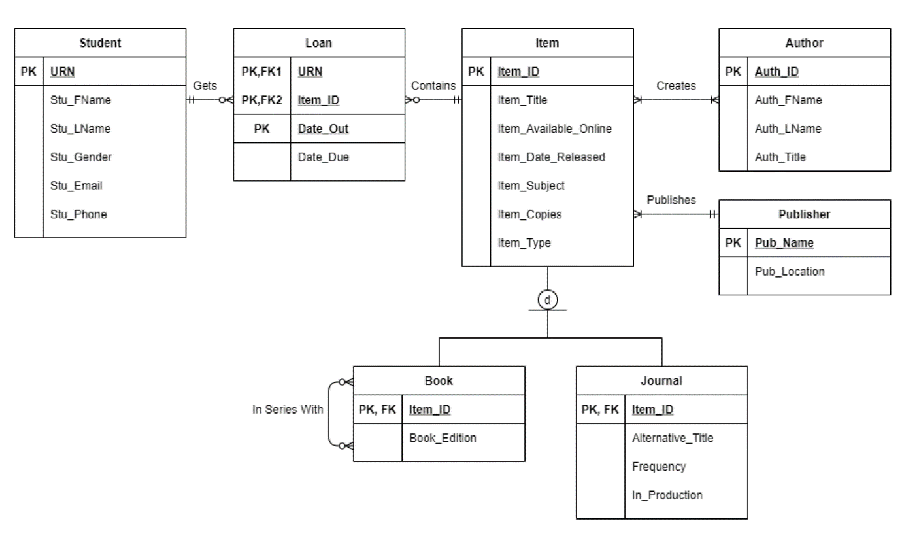
